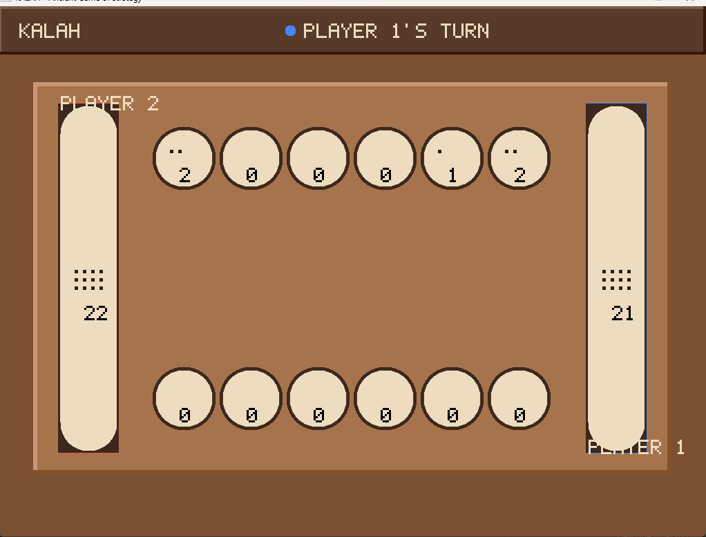

# KALAH

An implementation of **Kalah** (a Mancala family board game) written in C, built with a clean, layered architecture that separates the game engine from its user interfaces.



## About the Game

Kalah is a two-player turn-based strategy game played on a board of 12 small pits (6 per player) and 2 larger stores (Kalahs). Players sow stones counter-clockwise around the board, capturing opponent stones and racing to accumulate the most stones in their own Kalah. The game ends when one side's pits are all empty, with remaining stones swept into the corresponding store.

## Features

- Full implementation of Kalah's sowing rules — stones distributed one-by-one around the board, skipping the opponent's store
- Automatic turn switching, win/tie detection, and score tallying
- Two selectable interfaces built on the same game engine:
  - **CLI** — text-based play directly in the terminal
  - **Graphics (SDL2)** — a wooden-board styled GUI with mouse and keyboard controls, live stone counts, and turn indicators

## Architecture

The project follows a **Model–Engine–Interface** design:

```
include/
├── kalah_model.h       # Core data structures (piles, players, game state)
├── kalah_engine.h       # Game rules, move validation, sowing/capture logic
├── cli_interface.h      # Text-based UI
└── graphics_interface.h # SDL2 graphical UI

src/
├── model/    → kalah_model.c
├── core/     → kalah_engine.c
└── ui/
    ├── cli/      → cli_interface.c, main.c
    └── graphics/ → graphics_interface.c, main.c
```

This separation lets both interfaces reuse the same engine and data model without duplicating game logic.

## Building

```bash
make cli              # Build the CLI version
make graphics         # Build the SDL2 graphics version (requires SDL2)
make both             # Build both versions plus the shared library
make run              # Build and play the CLI version
make run-graphics     # Build and launch the graphics version
make clean            # Remove build artifacts
make help             # Show all available targets
```

## Requirements

- GCC (C99)
- SDL2 (only required for the graphics build)
